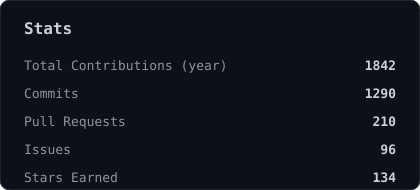
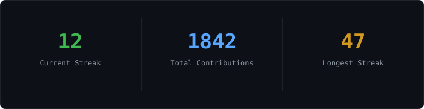
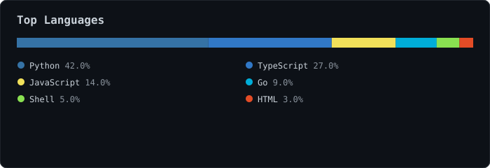
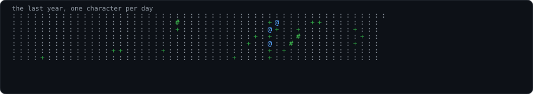

[website](https://example.com) · [twitter](https://twitter.com/singhvijayp) · [linkedin](https://www.linkedin.com/in/singhvijayp/) · [email](mailto:you@example.com)

> Software engineer building small, fast tools.
> [PLACEHOLDER — replace with your own one/two-line bio.]

I like shipping quickly and cutting scope ruthlessly. Currently working on
**[demo-project](https://github.com/singhvijayp/demo-project)** — a
[PLACEHOLDER: one sentence on what it does]. Also interested in
[PLACEHOLDER: a couple interests, e.g. distributed systems, ML infra, dev tools].

`python typescript javascript react node docker git linux`

**[demo-project](https://github.com/singhvijayp/demo-project)** · `typescript, react`
[PLACEHOLDER] One or two lines describing what this project does and why
it's interesting.

**[another-project](https://github.com/singhvijayp/another-project)** · `python`
[PLACEHOLDER] Same format — repo name, tags, short description.

**[portfolio](https://singhvijayp.dev)** · `next.js`
[PLACEHOLDER] Personal site / portfolio.

Every graphic on this page is generated, not embedded from anyone else's
server. The stat cards and section headings are drawn by
[a scheduled GitHub Action](./.github/workflows/stats.yml), once a day,
straight from the GitHub GraphQL API — committing only what changed.

They're plain SVG (no `<script>`, no `<style>` block) because GitHub strips
both from READMEs, and the headings are images rather than Markdown text for
the same reason: GitHub also strips CSS, so an image is the only way to set
a custom typeface here. Since nothing loads from a third-party server,
nothing on this page can rate-limit or go dark.

Numbers on this page right now are **placeholder demo data** — swap in your
real bio/projects above and let `scripts/generate_stats.py` fill in the
real stats on the first Action run (or run it locally with `--demo` to
regenerate placeholders).
